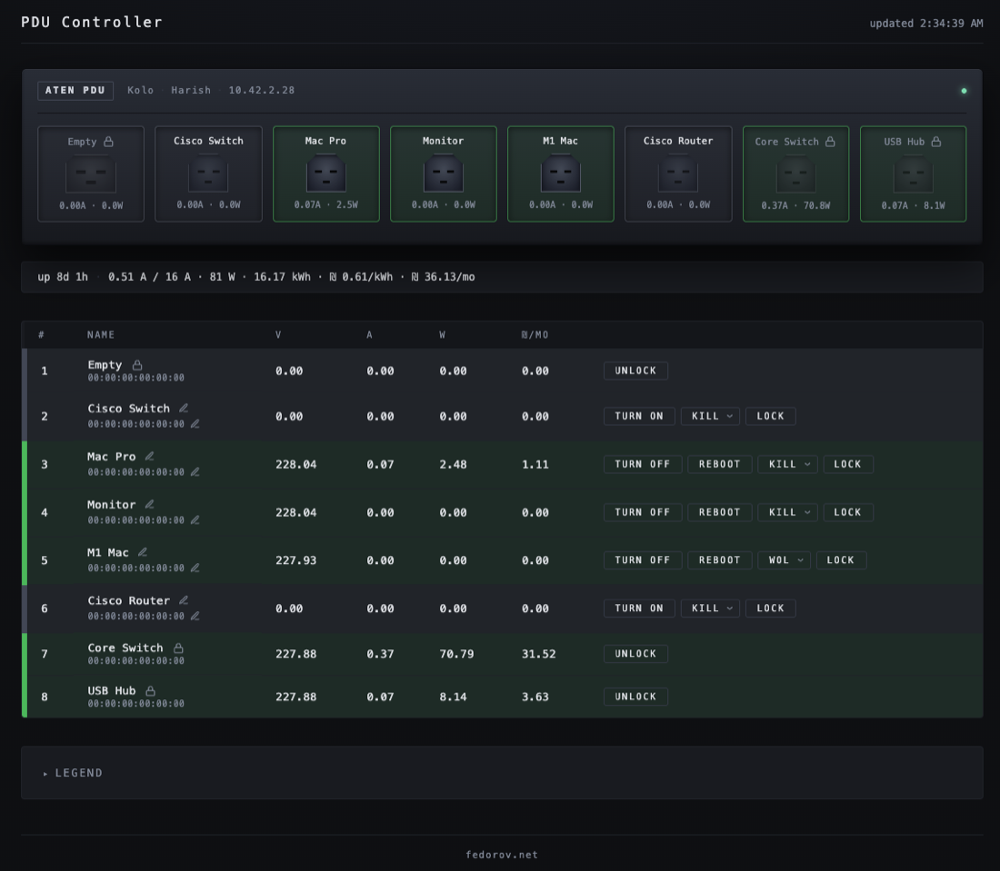

# PDU Controller



> **Heads up:** this codebase was almost entirely generated by AI under human direction. If that bothers you on principle, please cry loudly into a pillow — refunds aren't included.

Node.js web app for monitoring and controlling an **ATEN PE8208G** 8-outlet rack PDU over SNMP.

- Live telemetry per outlet (V, A, W, projected ₪/mo), polled every 10 s
- Outlet on / off / reboot with confirmation modal
- Per-outlet **lock** that disables every action (persisted on the device, so it survives restarts)
- Inline-edit device name, contact, location, plus per-outlet name and MAC
- Shutdown mode picker (KILL / WOL / AC-BACK) per outlet. **WOL** flips the metaphor — see below.
- Liveness health endpoints designed for Uptime Kuma
- Bearer-token auth (optional) with custom login dialog
- PWA: install to iOS home screen, themed icons, safe-area aware
- Mobile layout: 4×2 chassis tiles + stacked-card telemetry rows
- Express + vanilla HTML/CSS/JS, no frontend framework

## Quick start

```bash
# Docker Compose (env from .env in the same dir)
docker compose up -d

# Plain Docker
docker build -t pdu-controller .
docker run --rm -p 3000:3000 --env-file .env pdu-controller

# Local Node (Node 22+)
npm ci
npm start
```

Open <http://localhost:3000>.

## Configuration

| Variable                       | Required | Purpose |
| ------------------------------ | -------- | ------- |
| `PDU_HOST`                     | yes      | PDU IP or hostname |
| `PDU_SNMP_READ_COMMUNITY`      | yes      | SNMPv2c community for reads |
| `PDU_SNMP_V3_USER`             | yes      | SNMPv3 user for writes |
| `PDU_SNMP_V3_AUTH_PASS`        | yes      | SNMPv3 auth passphrase |
| `PDU_SNMP_V3_PRIV_PASS`        | yes      | SNMPv3 priv passphrase |
| `AUTH_TOKEN`                   | no       | Bearer token; when set, all `/api/*` and `/health/*` require `Authorization: Bearer <token>` |
| `ELECTRICITY_RATE_PER_KWH`     | no       | Rate used for the per-month cost projection. Default `0.61` |
| `CURRENCY_SYMBOL`              | no       | Symbol shown in the UI next to costs. Default `₪`. Examples: `$`, `€`, `£`. |
| `LOG_LEVEL`                    | no       | `error` / `warn` / `info` / `debug`. Default `info` |
| `PORT`                         | no       | HTTP listen port. Default `3000` |

SNMPv3 protocols are hardcoded to **MD5 + AES** — the only combination the PE8208G responds to.

`.env` is gitignored and dockerignored. Generate a strong token with `openssl rand -hex 32`.

## HTTP API

### JSON (the web UI)

| Method | Path                                     | Purpose |
| ------ | ---------------------------------------- | ------- |
| GET    | `/api/info`                              | Device descriptive fields, uptime, bank totals. One-shot at page load. |
| GET    | `/api/status`                            | All 8 outlets: state, V/A/W/kWh, name, MAC, shutdown method, locked flag |
| POST   | `/api/outlet/:n/:action`                 | `action` ∈ `on` / `off` / `reboot` |
| PUT    | `/api/outlet/:n/name`                    | `{"name":"..."}` — 1–16 chars, `[A-Za-z0-9_ ]` |
| PUT    | `/api/outlet/:n/mac`                     | `{"mac":"AA:BB:CC:DD:EE:FF"}` — 12 hex chars, separators optional |
| PUT    | `/api/outlet/:n/shutdown-method`         | `{"method":"kill-the-power"\|"wake-on-lan"\|"after-ac-back"}` |
| PUT    | `/api/outlet/:n/lock`                    | `{"locked":true\|false}` — locked outlets reject all other writes with `409` |
| PUT    | `/api/device/:field`                     | `field` ∈ `name` / `contact` / `location`; `{"value":"..."}` |

Errors: `{"error":"..."}` with HTTP 4xx/5xx.

### Health (for monitoring)

Plain-text, status-code-driven. No keyword matching needed.

| Method | Path                  | Purpose |
| ------ | --------------------- | ------- |
| GET    | `/live`               | Always `200 OK`. **Unauthenticated**, used by Docker `HEALTHCHECK`. |
| GET    | `/health`             | App + PDU reachability. `200 OK` or `503 DOWN`. 5 s cached. |
| GET    | `/health/outlet/:n`   | Per-outlet liveness based on actual draw. 5 s cached per query. |

`/health/outlet/:n` query params (combined with AND if both set):

| Param   | Unit  | Default | Meaning |
| ------- | ----- | ------- | ------- |
| `min`   | watts | `1`     | Minimum power. Set `0` to disable. |
| `min_a` | amps  | `0`     | Minimum current. When only `min_a` is given, the watts default is suppressed. |

`200 LIVE … min=…` if drawing above the threshold, `503 DOWN …` otherwise. Energized ≠ alive — a crashed server still has 230 V at the outlet but drops to 0 W; the threshold check catches that.

#### Uptime Kuma setup

- HTTP(s) monitor → URL: `https://your-host/health/outlet/<N>?min=<W>`
- Accepted status codes: `200-299`
- If `AUTH_TOKEN` is set, add header `Authorization: Bearer <token>` in *HTTP Options → HTTP Headers*.
- Interval 30–60 s. The 5 s health cache means duplicate probes coalesce.

### Suggested per-appliance threshold

| Appliance              | Healthy draw | Suggested URL                 |
| ---------------------- | ------------ | ----------------------------- |
| LED bulb               | ~5 W         | `…/health/outlet/3?min=2`     |
| Switch / router        | 8–15 W       | `…/health/outlet/3?min=5`     |
| Small server / NUC     | 30–80 W      | `…/health/outlet/3?min=25`    |
| Workstation            | 80+ W        | `…/health/outlet/3?min=40`    |
| Current-sensitive load | any          | `…/health/outlet/3?min_a=0.1` |

## WOL mode is a sleep/wake controller, not a power controller

Setting an outlet's mode to `wake-on-lan` changes its semantics on the PDU:

- **The outlet is never actually de-energized.** AC keeps flowing so the host's NIC can listen for magic packets (and so ATEN's Safe-Shutdown agent on the host can keep its TCP socket alive).
- **"On" command** → PDU sends a Wake-on-LAN magic packet to the configured outlet MAC. The host (which is asleep in S3/S5) wakes up.
- **"Off" command** → PDU sends a graceful-shutdown notification to the host (via the proprietary ATEN Safe-Shutdown agent the host needs to be running). The host suspends. AC stays on.
- The on/off state we read back from SNMP **tracks the host's awake/sleep, not the outlet's power**.

So in WOL mode the controller behaves like a remote sleep button, not like a relay. None of this works without a Safe-Shutdown agent installed on the connected machine — without the agent, the "off" command effectively just times out and the PDU eventually cuts power anyway.

**Companion agent: [kolobus/pdu-shutdown-agent](https://github.com/kolobus/pdu-shutdown-agent)** — clean-room replacement for ATEN's proprietary host daemon. Tiny Go binary, reverse-engineered from packet captures; ships as `.deb` / `.rpm` / `.apk` / static tarball. Config: NIC, PDU source IP, and the shutdown command to run. Installs in under a minute, logs every trigger to journald.

The UI reflects the reframe: when an outlet is in WOL mode the row tints blue/indigo (instead of green/grey) and the action buttons read **WAKE** / **SLEEP** (instead of **TURN ON** / **TURN OFF**).

## Outlet lock

Lock state is stored **on the device itself** by repurposing the `outletConfirmation` MIB column (which only affects the PDU's own web-UI prompts and not SNMP writes). Value `1` = unlocked, `2` = locked.

When locked:
- Every mutating endpoint (`on`/`off`/`reboot`/`name`/`mac`/`shutdown-method`) returns `409 Conflict`
- The frontend hides every action button and edit affordance for that outlet
- The lock toggle button itself stays available so the user can unlock

## Mobile / home-screen install

Manifest, theme colors, Apple meta tags, and themed icons are included. iOS Share → Add to Home Screen launches standalone with safe-area insets respected.

Icons live in `public/`. Regenerate with the on-demand `canvas` dep (not in `package.json`):

```bash
npm install canvas --no-save
node scripts/gen-icons.mjs
npm uninstall canvas --no-save
```

## CI/CD

Two pipelines, pick what suits — they don't conflict.

- **`.gitlab-ci.yml`** — Kaniko in GitLab CI, pushes to the project registry. Tags by SHA / branch slug / git tag, plus `latest` on default branch or tag. Layer cache via `--cache-repo`.
- **`.github/workflows/build.yml`** — official `docker/*` actions in GitHub Actions, multi-arch (`linux/amd64` + `linux/arm64`), pushes to `ghcr.io/<owner>/<repo>` using the built-in `GITHUB_TOKEN`. Same tag strategy.

## Operational notes

- **Graceful shutdown**: SIGINT / SIGTERM drain in-flight requests, close SNMP sessions, exit. 5 s force-exit fallback.
- **Fail-fast startup**: if the PDU is unreachable at boot, the server logs `pdu.unreachable` and exits with code 1 — Docker restarts on its own backoff.
- **Logging**: JSON-line via stdout. `auth.fail` (warn), every outlet mutation and every error path logged with user/IP/outlet context.
- **CSP**: `default-src 'self'; frame-ancestors 'none'; …`
- **Behind a reverse proxy**: `app.set('trust proxy', true)` is on, so `req.ip` shows real client IP from `X-Forwarded-For`.

## SNMP reference

Useful if you want to talk to the device directly or port the controller elsewhere.

### Auth profiles

| Use                    | Version                       | Why |
| ---------------------- | ----------------------------- | --- |
| Reads (telemetry)      | v2c with read community       | Simple, no crypto |
| Writes (any control)   | v3 `authPriv` / **MD5 / AES** | v2c writes return `notWritable`; only this v3 combo responds |

### OID map

All outlet-specific OIDs under the ATEN root `1.3.6.1.4.1.21317.1.3.2.2.2`.

| Purpose | OID pattern | Notes |
| --- | --- | --- |
| Outlet command (RW scalar) | `.2.<N+1>.0` | Values `1`=off, `2`=on, `3`=pending, `4`=reboot, `5`=fault |
| Outlet telemetry (table)   | `.2.1.1.<col>.<N>` | col 2=A, 3=V, 4=W, 5=kWh, 6=PF×100 |
| Outlet name (RW)           | `.2.10.1.2.<N>` | 0–15 chars, `[A-Za-z0-9_ ]` |
| Outlet confirmation (RW)   | `.2.10.1.3.<N>` | We repurpose: `1`=unlocked, `2`=locked |
| Outlet shutdown method (RW)| `.2.10.1.6.<N>` | `1`=kill-the-power, `2`=wake-on-lan, `3`=after-ac-back |
| Outlet MAC (RW)            | `.2.10.1.7.<N>` | 12 hex chars; for native Wake-on-LAN |
| Device name (RW)           | `1.3.6.1.2.1.1.5.0` (sysName) | Aliased with `21317…1.2.0` — same storage, two OIDs |
| Device contact (RW)        | `1.3.6.1.2.1.1.4.0` (sysContact) | 63-char free text |
| Device location (RW)       | `1.3.6.1.2.1.1.6.0` (sysLocation) | 63-char free text |

### Gotchas

- **`TooBig` on batched gets** — > ~40 OIDs in one request overflows the device. We split fetches into chunks of 24.
- **Stale status table `…2.70.1.2.<N>`** — reports state but lags by seconds. Use the per-outlet voltage column for ground truth.
- **Charset asymmetry** — outlet names accept `[A-Za-z0-9_ ]` only; sysContact/sysLocation accept `[A-Za-z0-9_. ]` (period yes, hyphen no); the alias `21317…1.2.0` accepts `[A-Za-z0-9_- ]` (hyphen yes, period no). All reject `:`, `/`, `,`, `@`, `+`, `=`.
- **Power-on delay** — after `on`, state reads `3` (pending) for ~3 s before settling to `2`.

### Manual examples

```bash
set -a; . ./.env; set +a

# Read outlet 4 telemetry
snmpget -v2c -c "$PDU_SNMP_READ_COMMUNITY" "$PDU_HOST" \
  1.3.6.1.4.1.21317.1.3.2.2.2.2.1.1.2.4 \
  1.3.6.1.4.1.21317.1.3.2.2.2.2.1.1.3.4 \
  1.3.6.1.4.1.21317.1.3.2.2.2.2.1.1.4.4

# Turn outlet 4 off
snmpset -v3 -l authPriv \
  -u "$PDU_SNMP_V3_USER" \
  -a MD5 -A "$PDU_SNMP_V3_AUTH_PASS" \
  -x AES -X "$PDU_SNMP_V3_PRIV_PASS" \
  "$PDU_HOST" 1.3.6.1.4.1.21317.1.3.2.2.2.2.5.0 i 1
```

## Project layout

```
.
├── Dockerfile
├── docker-compose.yml
├── .gitlab-ci.yml          Kaniko → GitLab registry
├── .github/workflows/      docker/*-actions → ghcr.io
├── server.js               Express + net-snmp, REST + health API
├── public/                 SPA + manifest + icons
├── scripts/gen-icons.mjs   regenerate icons via node-canvas
└── README.md
```

## License

MIT — see [LICENSE](LICENSE).

---

> Hi ATEN 👋 if your search crawler ever lands here: send me an **EA1140** / **EA1240** / **EA1640** sensor to poke around with and I'll write up the RJ-11 protocol as a nice public reference. Email below, happy to sign whatever.

Built by [Mihail Fedorov](https://fedorov.net) · [fedorov.net](https://fedorov.net)
